# Visual Cheat Sheets — CompTIA Project+ (PK0-005)

Quick visual references for the most important PK0-005 concepts, all in one place. Each cheat sheet is a Mermaid concept map that renders right here on GitHub.

**How to read them**

- The center is the topic.
- The first level groups items into categories.
- Leaves give the term plus a one-line definition; *italics* flag qualifiers.
- Colors carry meaning per topic: red = negative/threat, green = positive/safe, amber = caution/medium, blue = neutral, purple = hybrid.

## Contents

1. [Project Life Cycle Phases](#01--project-life-cycle-phases) — Domain 2
2. [Methodologies and Frameworks](#02--methodologies-and-frameworks) — 1.1 · 1.2
3. [Project Selection Methods](#03--project-selection-methods) — 2.1
4. [RFx Documents (RFI / RFP / RFQ / RFB)](#04--rfx-documents-engaging-vendors) — 1.11
5. [Vendor Contract Types](#05--vendor-contract-types) — 1.11
6. [Estimating Methods](#06--estimating-methods) — 1.6
7. [Dependency Types](#07--dependency-types) — 1.6
8. [Risk Analysis Methods](#08--risk-analysis-methods) — 1.4
9. [Risk Responses](#09--risk-responses) — 1.4
10. [Tuckman Ladder](#10--tuckman-ladder-team-development) — 1.10
11. [Organizational Structures](#11--organizational-structures-pm-authority-gradient) — 1.10
12. [RACI Roles](#12--raci-roles) — 2.2
13. [Conflict Management (Thomas-Kilmann)](#13--conflict-management-thomas-kilmann) — 2.4
14. [Meeting Types](#14--meeting-types) — 1.9
15. [Quality and Performance Charts](#15--quality-and-performance-charts) — 3.3
16. [Cloud Models](#16--cloud-models) — 4.4
17. [EVM — Earned Value Management Formulas](#17--evm--earned-value-management-formulas) — 1.7
18. [Study and Exam Tips](#study-and-exam-tips)

---

## 01 — Project Life Cycle Phases

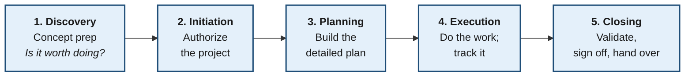

> Full walkthrough and document flow: [Domain 2](Domain2-Project-Life-Cycle-Phases.md).

---

## 02 — Methodologies and Frameworks

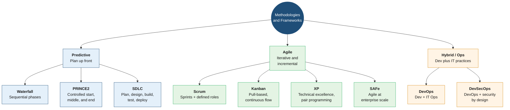

> See [Domain 1 → 1.1](Domain1-Project-Management-Concepts.md#11--project-characteristics-methodologies--frameworks) and [1.2](Domain1-Project-Management-Concepts.md#12--agile-vs-waterfall).

---

## 03 — Project Selection Methods

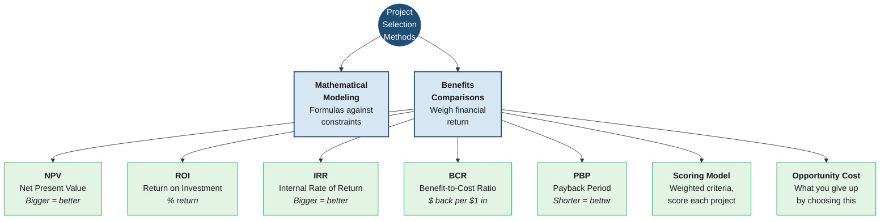

> See [Domain 2 → 2.1](Domain2-Project-Life-Cycle-Phases.md#21--discovery--concept-preparation).

---

## 04 — RFx Documents (Engaging Vendors)

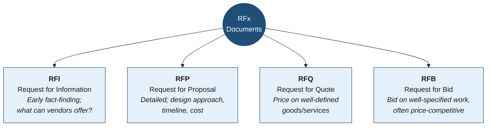

> See [Domain 1 → 1.11](Domain1-Project-Management-Concepts.md#111--procurement--vendor-selection).

---

## 05 — Vendor Contract Types

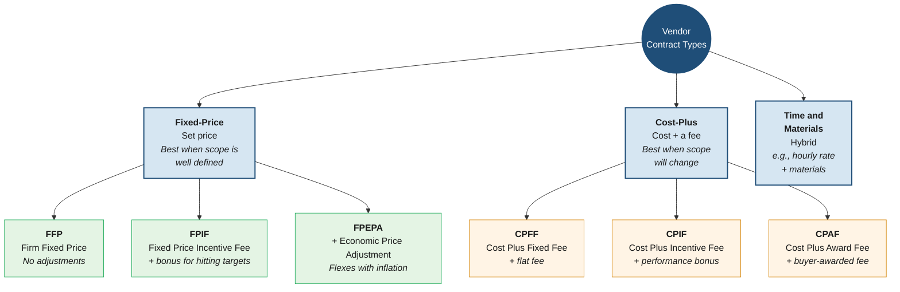

> See [Domain 1 → 1.11](Domain1-Project-Management-Concepts.md#111--procurement--vendor-selection).

---

## 06 — Estimating Methods

> Ordered from **fastest / least accurate** to **slowest / most accurate**.

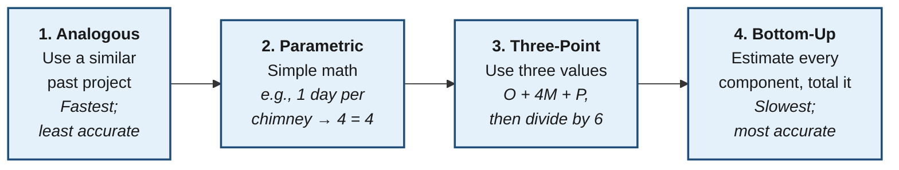

> See [Domain 1 → 1.6](Domain1-Project-Management-Concepts.md#16--schedule-development--management).

---

## 07 — Dependency Types

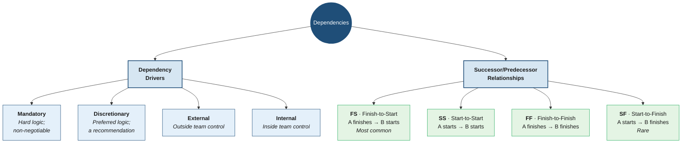

> See [Domain 1 → 1.6](Domain1-Project-Management-Concepts.md#16--schedule-development--management).

---

## 08 — Risk Analysis Methods

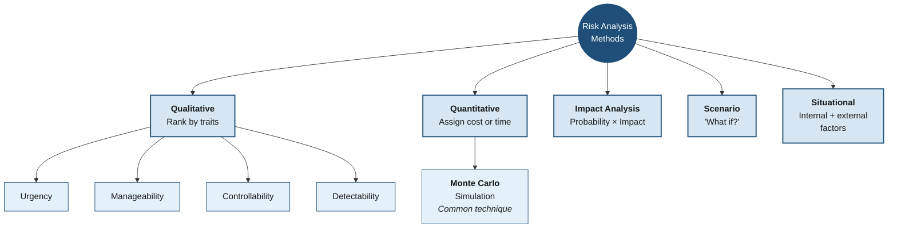

> See [Domain 1 → 1.4](Domain1-Project-Management-Concepts.md#14--risk-management).

---

## 09 — Risk Responses

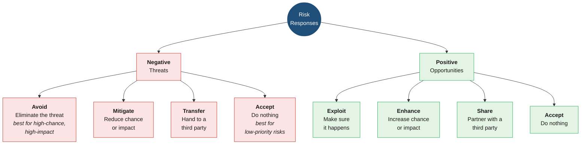

> See [Domain 1 → 1.4](Domain1-Project-Management-Concepts.md#14--risk-management).

---

## 10 — Tuckman Ladder (Team Development)

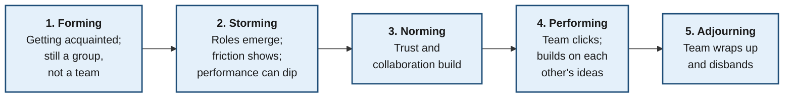

> See [Domain 1 → 1.10](Domain1-Project-Management-Concepts.md#110--team--resource-management).

---

## 11 — Organizational Structures (PM Authority Gradient)

> Colored by **how much authority the PM has**: red = low, amber = medium, green = high.

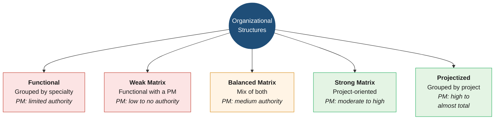

> See [Domain 1 → 1.10](Domain1-Project-Management-Concepts.md#110--team--resource-management).

---

## 12 — RACI Roles

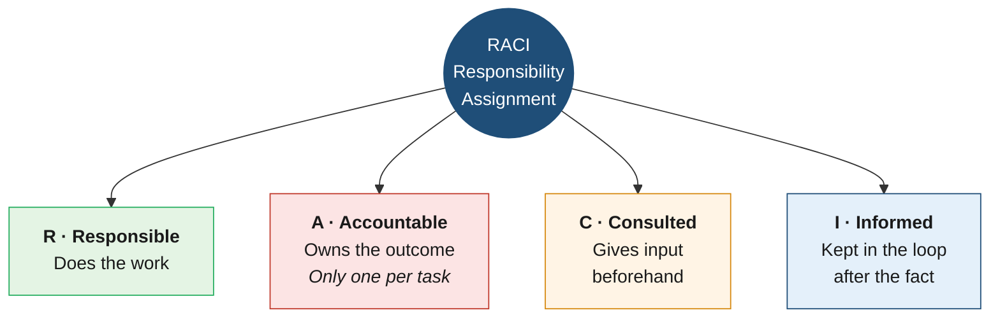

> See [Domain 2 → 2.2](Domain2-Project-Life-Cycle-Phases.md#22--initiation) and the [sample RACI Matrix](samples/09-raci-matrix.xlsx).

---

## 13 — Conflict Management (Thomas-Kilmann)

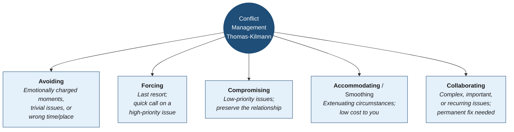

> See [Domain 2 → 2.4](Domain2-Project-Life-Cycle-Phases.md#24--execution).

---

## 14 — Meeting Types

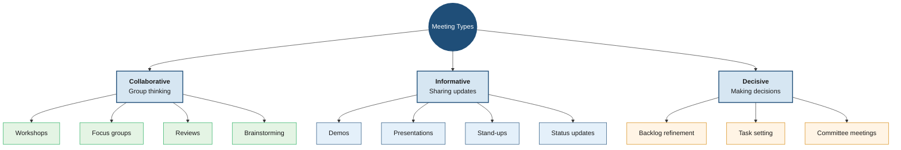

> See [Domain 1 → 1.9](Domain1-Project-Management-Concepts.md#19--meeting-management).

---

## 15 — Quality and Performance Charts

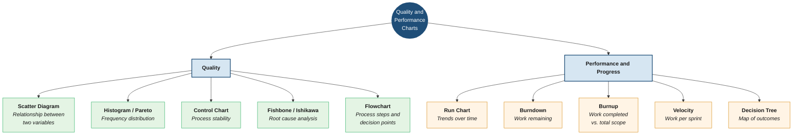

> See [Domain 3 → 3.3](Domain3-Tools-and-Documentation.md#33--quality--performance-charts).

---

## 16 — Cloud Models

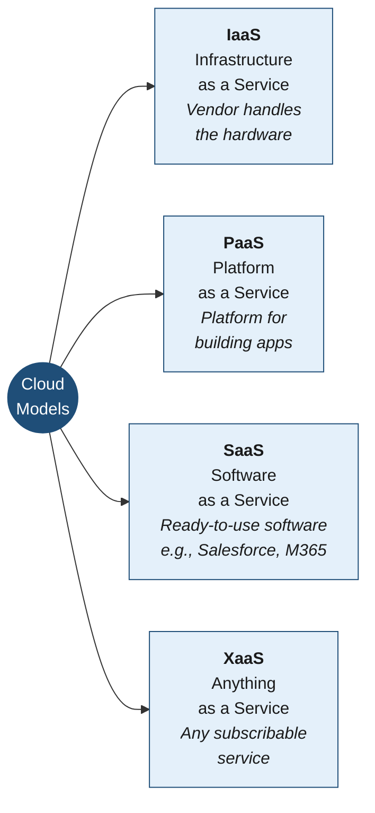

> See [Domain 4 → 4.4](Domain4-Basics-of-IT-and-Governance.md#44--basic-it-concepts).

---

## 17 — EVM — Earned Value Management Formulas

> Know these even if they don't appear heavily on your exam — they're the backbone of cost/schedule performance tracking. Full formula reference: [`Formulas and Equations Reference Guide for Project+ (Exam PK0-005).pdf`](Formulas%20and%20Equations%20Reference%20Guide%20for%20Project%2B%20%28Exam%20PK0-005%29.pdf).

```mermaid
flowchart TD
    R(("EVM<br/>Earned Value<br/>Management"))
    R --> IN["<b>Inputs</b>"]
    R --> VA["<b>Variances</b><br/><i>negative = bad</i>"]
    R --> PE["<b>Performance Indices</b><br/><i>&lt;1 = bad, &gt;1 = good</i>"]
    R --> FO["<b>Forecasts</b>"]

    IN --> PV[<b>PV</b> · Planned Value<br/><i>What you planned<br/>to have done by now</i>]
    IN --> EV[<b>EV</b> · Earned Value<br/><i>Value of work<br/>actually completed</i>]
    IN --> AC[<b>AC</b> · Actual Cost<br/><i>What you've actually<br/>spent so far</i>]
    IN --> BAC[<b>BAC</b> · Budget at Completion<br/><i>Total planned budget</i>]

    VA --> CV[<b>CV = EV − AC</b><br/>Cost Variance]
    VA --> SV[<b>SV = EV − PV</b><br/>Schedule Variance]

    PE --> CPI[<b>CPI = EV ÷ AC</b><br/>Cost Performance Index]
    PE --> SPI[<b>SPI = EV ÷ PV</b><br/>Schedule Performance Index]

    FO --> EAC[<b>EAC = AC + ETC</b><br/>Estimate at Completion]
    FO --> ETC["<b>ETC = BAC − EV</b><br/>Estimate to Complete<br/><i>budgeted-rate version</i>"]
    FO --> VAC[<b>VAC = BAC − EAC</b><br/>Variance at Completion]

    classDef root fill:#1F4E78,stroke:#1F4E78,color:#ffffff,stroke-width:2px
    classDef cat fill:#D6E6F2,stroke:#1F4E78,color:#1a1a1a,stroke-width:2px
    classDef leaf fill:#E4F0FA,stroke:#1F4E78,color:#1a1a1a
    classDef bad fill:#FCE4E4,stroke:#C0392B,color:#1a1a1a
    classDef good fill:#E4F4E4,stroke:#27AE60,color:#1a1a1a
    class R root
    class IN,VA,PE,FO cat
    class PV,EV,AC,BAC,EAC,ETC,VAC leaf
    class CV,SV bad
    class CPI,SPI good
```

> CV and SV are also covered in [Domain 1 → 1.7](Domain1-Project-Management-Concepts.md#17--quality--performance-management).

---

## Study and Exam Tips

> Compiled from the official PK0-005 objectives plus practical advice from a fellow exam-taker. Treat anyone's recap as one data point — your experience may differ.

### Best sources

- The [CBT Nuggets course](https://learn.adept.at/cbtnuggets/comptia-project-pk0-005) these notes come from.
- AI-generated practice exams and study guides.
- The official [exam objectives PDF](comptia-project-pk0-005-exam-objectives-(2-0).pdf.pdf) and [formulas reference](Formulas%20and%20Equations%20Reference%20Guide%20for%20Project%2B%20%28Exam%20PK0-005%29.pdf) in this repo.

### What to memorize cold

- The **5 lifecycle phases** and which documents live where — Charter = Initiation, Scope Statement = Planning, Issue Log = Execution, Lessons Learned / Closeout Report = Closing. See [Domain 2's document flow](Domain2-Project-Life-Cycle-Phases.md#putting-it-together--document-flow-across-the-phases).
- The **quality and performance charts** in cheat sheet 15 — including fishbone (Ishikawa) and flowchart.
- The **EVM formulas** in cheat sheet 17 — even if your test doesn't lean on them, they could show up.
- The **successor/predecessor dependency types** (FS / SS / FF / SF).
- **Risk responses** for both negative *and* positive risks.

### Test-day strategy

- **Brain-dump first.** As soon as you're allowed, write down formulas and mnemonics on your scratch paper so you don't have to hold them in working memory.
- **Flag performance-based questions (PBQs) and come back later.** They take longer; don't burn time at the start.
- **Read each question carefully.** Slow down on the question stem — CompTIA loves "best" and "first" qualifiers.
- **Use process of elimination.** You can usually narrow four choices to two, then pick the best fit.
- **Don't overthink.** Your first instinct is usually right.

### Don't panic about practice-test scores

It's common to score in the 60–70% range on Certmaster/Sybex practice exams and still pass the real one. The real exam tends to be more direct than the practice sets, and the PBQs are usually easier than the practice PBQs.

You've got this.
