# Domain 1 — Project Management Concepts

> **Exam weight: 33%** (the biggest domain). Covers the core vocabulary and methods of project management: what a project is, Agile vs. Waterfall, change/risk/issue handling, scheduling, quality, communication, meetings, teams, and procurement.

**Jump to an objective:**

- [1.1 — Project characteristics, methodologies & frameworks](#11--project-characteristics-methodologies--frameworks)
- [1.2 — Agile vs. Waterfall](#12--agile-vs-waterfall)
- [1.3 — The change control process](#13--the-change-control-process)
- [1.4 — Risk management](#14--risk-management)
- [1.5 — Issue management](#15--issue-management)
- [1.6 — Schedule development & management](#16--schedule-development--management)
- [1.7 — Quality & performance management](#17--quality--performance-management)
- [1.8 — Communication management](#18--communication-management)
- [1.9 — Meeting management](#19--meeting-management)
- [1.10 — Team & resource management](#110--team--resource-management)
- [1.11 — Procurement & vendor selection](#111--procurement--vendor-selection)

---

## 1.1 — Project characteristics, methodologies & frameworks

### What makes something a project?

A project is a **one-and-done effort**. Three things define it:

- **Unique** — it produces a one-of-a-kind result.
- **Temporary** — it has a clear start and finish.
- **Purposeful** — it exists to deliver business value.

### Project, program, or portfolio?

These three nest inside each other:

- **Program** — a group of *related* projects run together. The focus is the **interdependencies** between them.
- **Portfolio** — all the projects and programs, chosen to push the organization's **strategic goals**. This is the big-picture, "do these even align with our strategy?" view.

A project can stand alone, live inside a program, or live inside a portfolio.

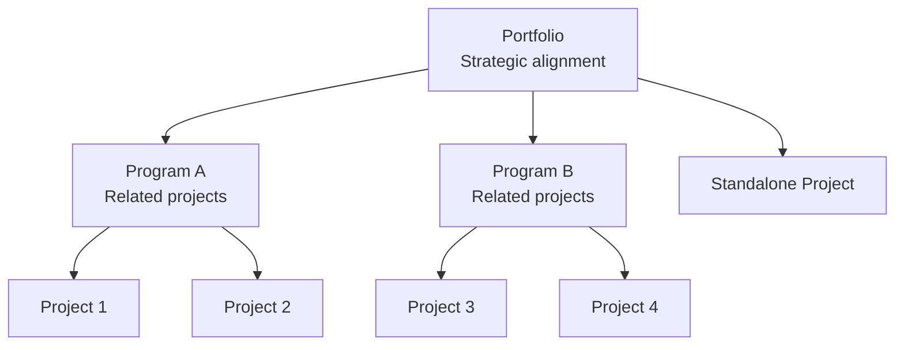

### Methodologies & frameworks to know

**Scrum** is an Agile framework. Beyond it, expect these on the exam:

- **Kanban** — a "pull-based" approach using a Kanban board so work flows continuously.
- **Extreme Programming (XP)** — focused on technical excellence: pair programming, collective code ownership, test-driven development, spiking, refactoring, continuous integration.
- **SAFe (Scaled Agile Framework)** — best practices for doing Agile at enterprise scale.
- **PRINCE2 (PRojects IN Controlled Environments)** — an organized, controlled start, middle, and end.
- **SDLC (Software Development Life Cycle)** — plan, design, build, test, deploy.
- **DevOps** — combines software development and IT operations.
- **DevSecOps** — DevOps with security built in by design.

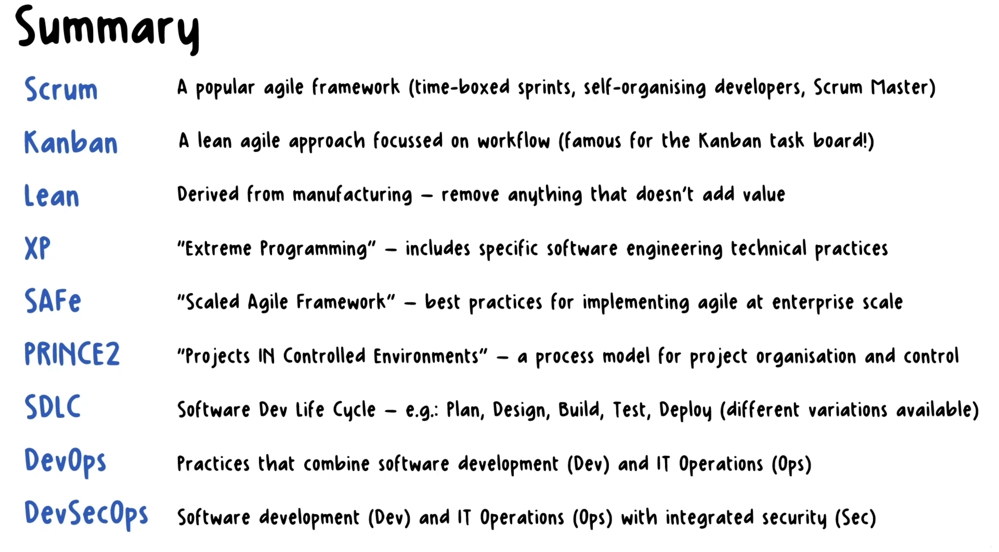

---

## 1.2 — Agile vs. Waterfall

### The one-line difference

- **Waterfall** — *predictive*. You plan it all up front; changes aren't expected (only essential ones).
- **Agile** — *iterative and incremental*. You build in small pieces and adapt as you go.

### The Agile Manifesto

> We value:
>
> - **Individuals and interactions** over processes and tools
> - **Working software** over comprehensive documentation
> - **Customer collaboration** over contract negotiation
> - **Responding to change** over following a plan
>
> There's value in the items on the right, but we value the items on the left more.

Source: <https://agilemanifesto.org/>

### The 12 Principles of Agile

1. Satisfy the customer through early and continuous delivery of valuable software.
2. Welcome changing requirements — it gives the customer a competitive advantage.
3. Deliver working software frequently.
4. Business people and developers work together daily.
5. Build projects around motivated people; give them what they need.
6. Face-to-face conversation is the best form of communication.
7. Working software is the primary measure of progress.
8. Maintain a constant, sustainable pace.
9. Keep up continuous attention to technical excellence and good design.
10. Simplicity — maximize the work *not* done.
11. The best work emerges from self-organizing teams.
12. At regular intervals, reflect, then tune and adjust behavior.

---

## 1.3 — The change control process

**The point:** stop **scope creep** by running every change through a defined process.

A change request can come from anyone on the project. It should be in writing and explain *why*.

### The 12 steps

1. **Create / receive** the change request.
2. **Log** it in the change request log.
3. **Preliminary review** — chat with the team and subject matter experts (SMEs): is it feasible?
4. **Assess impact** — what else does this touch?
5. **Document the recommendation** from that assessment.
6. **Determine the decision makers**.
7. **Escalate to the CCB** (Change Control Board) — the panel that approves or denies.
8. **Document and communicate the status.** *If denied, it stops here.*
9. **Update the project plan** (schedule, scope statement, etc.).
10. **Implement** the change.
11. **Validate** the implementation.
12. **Communicate** the deployment.

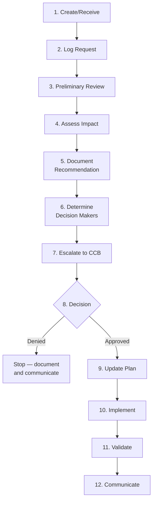

---

## 1.4 — Risk management

### What a risk is

A **risk** is an *uncertain* event that, if it happens, will affect the project. It can be **negative or positive**. We identify, analyze, and plan responses during **planning**.

Agile carries more uncertainty by nature, so it manages risk by committing to only a little work at a time.

### Identifying risks: SWOT

**SWOT** stands for **Strengths, Weaknesses, Opportunities, Threats** — a four-quadrant way to brainstorm risks. Strengths and weaknesses look *inward*; opportunities and threats look *outward*.

| | Positive | Negative |
|---|---|---|
| **Internal** | **Strengths** — what we do well | **Weaknesses** — internal gaps |
| **External** | **Opportunities** — favorable outside factors | **Threats** — supply-chain issues, new laws, etc. |

**Known risks** are the ones we can anticipate.

### Analyzing risks

- **Qualitative** — rank risks by urgency, manageability, controllability, detectability.
- **Impact analysis** (probability vs. impact) — e.g., *low probability, medium impact*.
- **Quantitative** — assign a cost or time value. Can use simulations like **Monte Carlo analysis**.
- **Scenario analysis** — "what if?"
- **Situational analysis** — examine internal and external factors.

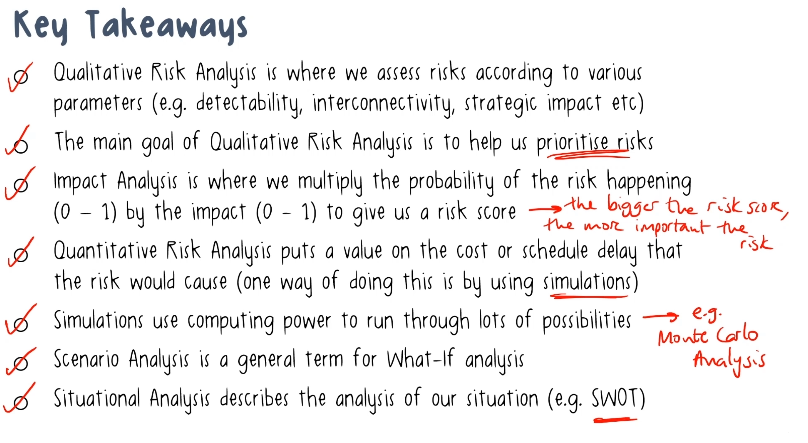

### Responding to risks

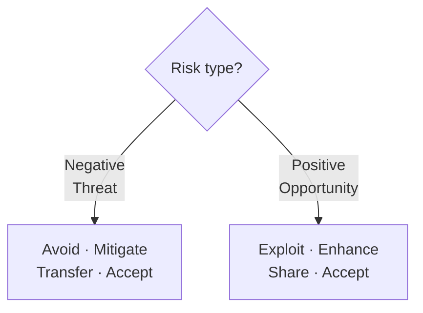

**Negative risks (threats):**

- **Avoid** — eliminate the threat. Best for high-chance, high-impact threats.
- **Mitigate** — reduce the chance or impact.
- **Transfer** — hand ownership to a third party.
- **Accept** — do nothing proactive. Best for low-priority risks.

**Positive risks (opportunities):**

- **Exploit** — make sure it happens.
- **Enhance** — increase the chance or impact.
- **Share** — partner with a third party to share the upside.
- **Accept** — do nothing proactive.

---

## 1.5 — Issue management

### Risk vs. issue

A **risk** *might* happen. An **issue** has *already* happened and is impacting the project right now. **Issues are always negative** — think of an issue as a risk that came true.

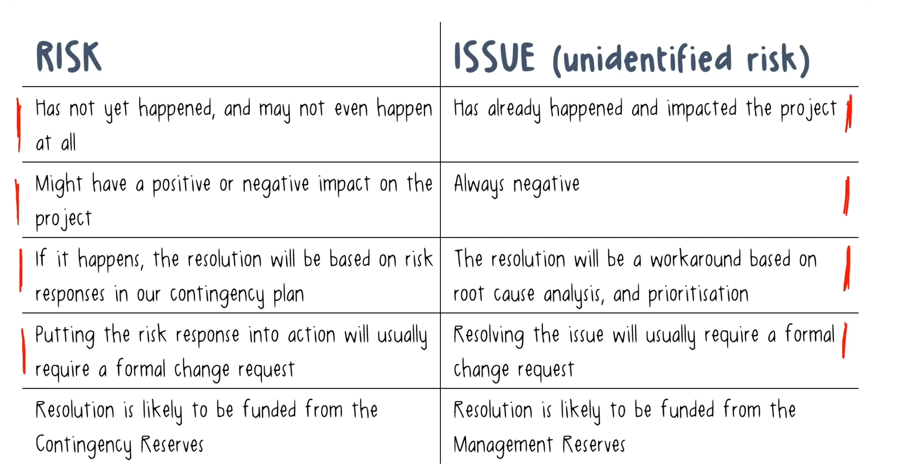

### Handling an issue

- Record it in the **issue log**.
- Notify the right stakeholders.
- Build a **resolution plan**:
  - Prioritize by severity, impact, and urgency.
  - Do **root cause analysis** (e.g., cause-and-effect diagrams).
  - Apply a **workaround** if needed.
- Document the outcome and update other project docs.

### Risk & issue documentation

- **Risk Management Plan** — your "how-to" guide for handling risk. Part of the project plan.
- **Risk Register** — the running list of risks (ID, description, owner). Usually a spreadsheet; review it regularly.
- **Contingency Plan** — your planned response to identified risks.
- **Fallback Plan** — plan B (used when the contingency plan also fails).
- **Issue Log** — the running record of issues and their status.

#### Sample documents

> Full filled-in examples live in [`samples/`](samples/) — see the [Risk Register](samples/06-risk-register.xlsx) and [Issue Log](samples/07-issue-log.xlsx).

**Risk Management Plan (excerpt):**

> Risks are scored 1–5 on both probability and impact. Any risk scoring High/High is escalated to the sponsor within 24 hours. Risks are reviewed at every sprint retrospective. The project manager owns the risk register.

**Risk Register:**

| ID | Risk | Probability | Impact | Response | Owner |
|---|---|---|---|---|---|
| R-01 | Cloud vendor API delayed | Medium | High | Mitigate — start integration early | J. Lee |
| R-02 | Lead developer may leave | Low | High | Transfer — cross-train a backup | PM |

**Contingency Plan (example):**

> If the payment gateway isn't certified by week 8, launch with the pre-built PayPal module and add the primary gateway in a later release.

**Fallback Plan (example):**

> If both the gateway *and* PayPal are blocked, postpone launch by two weeks and process orders manually.

**Issue Log:**

| ID | Issue | Raised | Severity | Owner | Status |
|---|---|---|---|---|---|
| I-01 | Test server crashed during user acceptance testing | May 3 | High | DevOps | In progress |
| I-02 | Login page rejects valid users | May 5 | Critical | A. Kim | Resolved |

---

## 1.6 — Schedule development & management

Mostly a Waterfall topic. Four moving parts: estimate durations, sequence activities, build the schedule, assign resources.

### Estimating durations

Break the work breakdown structure (WBS) into work packages, then into activities. Four techniques, from fastest to most accurate:

1. **Analogous** — use a similar past project. Apples to apples.
2. **Parametric** — simple math (1 day per chimney → 4 chimneys = 4 days).
3. **Three-point** — use three values for a more realistic estimate.
4. **Bottom-up** — estimate every component and total it.

**Terms to keep straight:**

- **Effort** — the work required (hours, days, weeks).
- **Duration** — factors in the resources assigned.
- **Elapsed time** — factors in how much work fits each day/week.
- **Contingency reserves (buffers)** — cushion time for delays.

### Sequencing activities

**Dependencies** shape the order:

- **Mandatory** — hard logic, non-negotiable.
- **Discretionary** — preferred logic, a recommendation.
- **External** — outside the team's control.
- **Internal** — inside the team's control.

**Successor/predecessor relationships:**

- **Finish-to-Start (FS)** — A must finish before B starts. *(Most common.)* *Example: the walls must be framed (A) before drywall can go up (B).*
- **Start-to-Start (SS)** — A must start before B starts. *Example: once data migration starts (A), QA testing of the migrated records can start (B).*
- **Finish-to-Finish (FF)** — A must finish before B finishes. *Example: coding (A) must be finished before code review (B) can be finished.*
- **Start-to-Finish (SF)** — A must start before B finishes. *(Rare.)* *Example: the new support system must go live (A) before the old system can be shut down (B).*

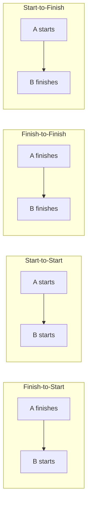

### Building the schedule

- **PERT chart** (Program Evaluation and Review Technique) — a network diagram; an example of the **Precedence Diagramming Method (PDM)**.

  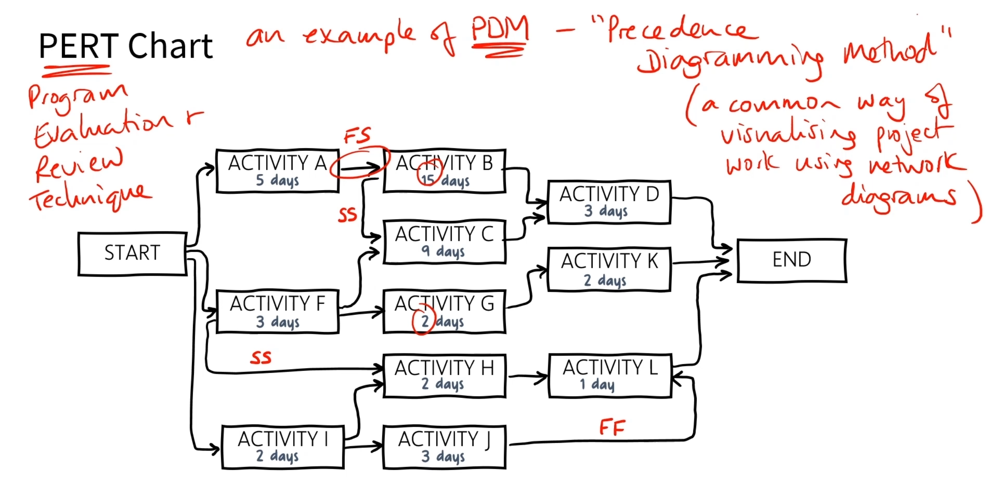

- **Gantt chart** — bars show each task's timeline.

  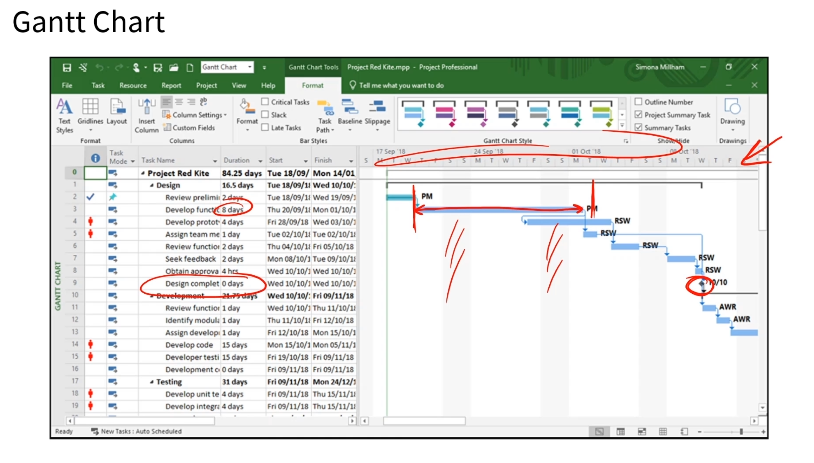

- **Critical path** — the longest sequence of activities; it sets the shortest possible project duration.

  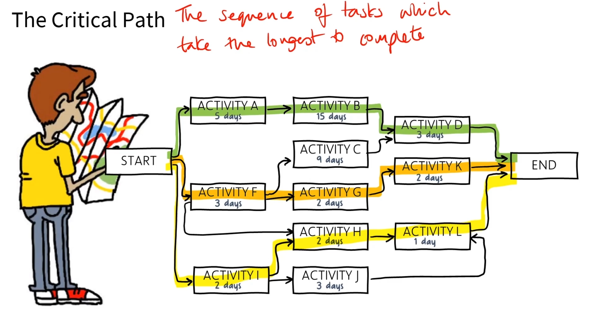

> Formulas for PERT, early/late start and finish, float, and the critical path are in the *Formulas Reference* PDF.

### Assigning resources

- **Resource loading** — fill team members' available time with tasks.
- **Resource leveling** — adjust the schedule to match resource availability.
- **Resource smoothing** — delay tasks only within their **float** (the slack a task has before it delays the project).
- **Schedule compression** — finish faster without cutting scope:
  - **Fast tracking** — overlap critical-path tasks. *May add risk.*
  - **Crashing** — add resources to critical-path tasks.

### Budget basics

- **Cost baseline** — the approved, time-phased budget (excludes management reserves). Changes only through formal change control.
- **Cost estimate** — the likely cost of *all* resources for an activity (labor, materials, equipment).
- **Contingency reserves** — for *known* risks; sit inside the baseline.
- **Management reserves** — for *unknown* issues; sit *outside* the baseline.

### Agile scheduling

- **Story point** — a unit of estimated *effort* for a backlog item. Just an estimate.
- **Velocity** — how much work the team finishes per sprint (sum of completed story points from past sprints).
- **Epic** — a big chunk of work spanning multiple sprints; often a broad, not-yet-defined area.
- **Sprint planning** — the sponsor sets the sprint goal; chosen stories support that goal, are sized and prioritized, and fit the team's velocity.
- **Release planning** — decides *when* features ship to users.

---

## 1.7 — Quality & performance management

### Tracking performance

Compare current performance against the **baselines** in the original project management plan.

- **Cost Variance (CV)** — value of work done vs. money actually spent. *Negative = over budget.* *Example: you've completed $10k worth of work but spent $12k → CV = –$2k, so you're $2k over budget.*
- **Schedule Variance (SV)** — value of work done vs. work planned by now. *Negative = behind schedule.* *Example: you planned to have $10k of work done by today but only $8k is finished → SV = –$2k, so you're behind schedule.*
- **Iteration burndown chart** — work remaining in the iteration.
- **KPIs (key performance indicators)** — measurable values that track progress.
- **Phase gate review** — a checkpoint at the end of a phase: continue or not?

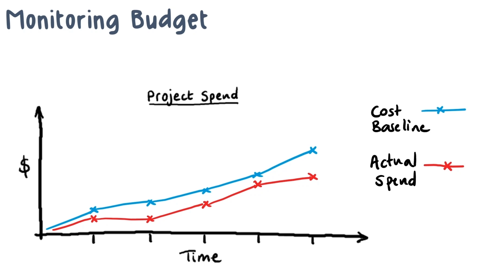

> See [Domain 3 → 3.3](Domain3-Tools-and-Documentation.md#33--quality--performance-charts) for the charts that visualize this data.

### Managing quality

A **quality management plan** is your "how-to" guide for quality. Quality work leans on **audits and inspections** plus charts (covered in Domain 3).

### Testing types

- **Unit** — one piece of code works on its own.
- **Integration** — combined units work as a group.
- **Regression** — everything still works after changes.
- **Smoke** — quick check that the big stuff works.
- **Stress** — stability under heavy load.
- **Performance** — speed, stability, responsiveness.
- **User acceptance (UAT)** — the end user confirms it does the job.

### Verification vs. validation

- **Verification** — does it meet the spec/requirement? Done through quality control (QC). *Did we build it right?*
- **Validation** — formal acceptance that it matches scope. Happens *after* verification. *Did we build the right thing?*

Validation happens as major deliverables land, the customer may request changes first, and you do it **even if the project is cancelled**.

### Lessons learned & reviews

**Lessons learned** capture what worked and what didn't, to improve future projects. Run a review meeting with the team, key stakeholders, and the sponsor.

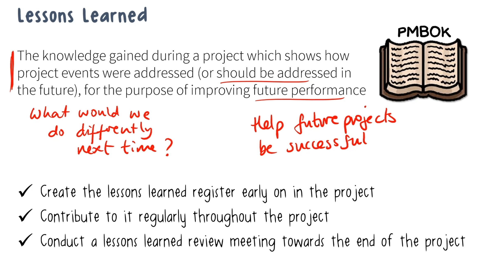

**Two kinds of knowledge:**

- **Explicit** — written down and easily shared (documents, reports).
- **Tacit** — personal insight and intuition; hard to capture.

**Review types:**

- **Phase gate review** — end of a phase; continue or not.
- **Sprint review** — *product*-focused; product owner, dev team, and interested stakeholders attend.
- **Sprint retrospective** — *process*-focused; the team reflects and adjusts.

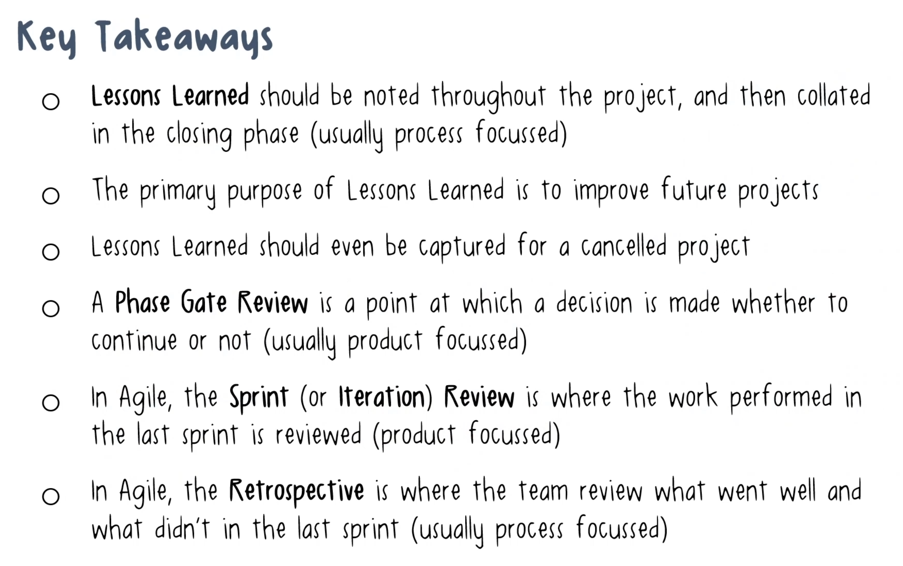

---

## 1.8 — Communication management

### Pick the right method

- **Written** — consider the audience and flow; you can take your time.
- **Verbal** — tone, body language, word choice.
- **Formal** vs. **informal**.
- **Synchronous** (real time) — meetings, calls, chat.
- **Asynchronous** (not real time) — email, SMS, reports.
- **Internal** vs. **external**.

**Quick rules of thumb:**

- Sensitive issue → **face-to-face**.
- Detailed info → **written**.
- Routine updates → **weekly emails**, consistent format.

### Common challenges

Language barriers, cultural differences, time zones / geography, and technology gaps.

### Planning communications

The communication plan defines **who** gets **what**, in which **format**, and **how often**.

- Start from stakeholder needs.
- Use templates and guidelines.
- Mind constraints — tech limits, data-protection rules, org policy.
- Decide where records are archived.
- Monitor effectiveness and adjust.

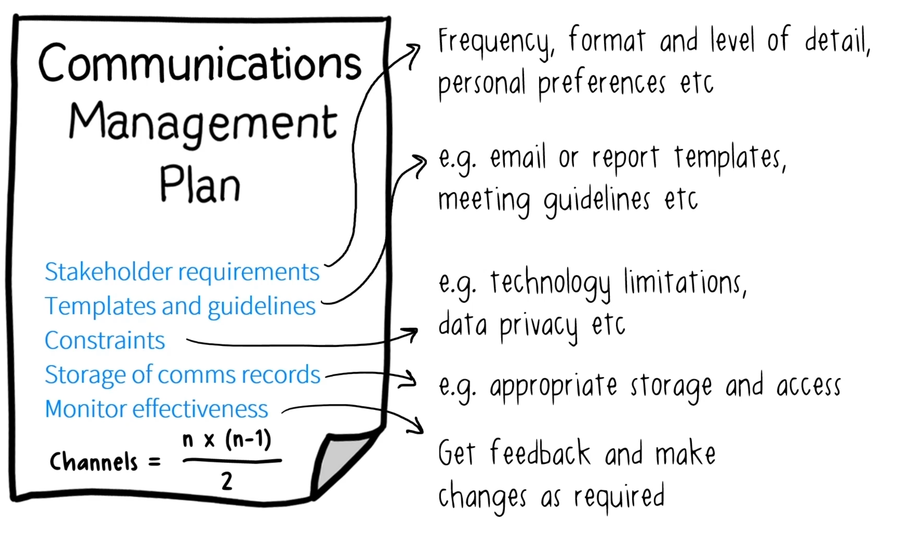

---

## 1.9 — Meeting management

### Three meeting types

- **Collaborative** — workshops, focus groups, reviews, brainstorming.
- **Informative** — demos, presentations, stand-ups, status updates.
- **Decisive** — backlog refinement, task setting, committee meetings.

### Run it well

- Invite the right people.
- Send an agenda ahead of time.
- Assign roles:
  - **Facilitator** — keeps it on time and on topic; owns follow-ups.
  - **Scribe** — agreed in advance to take notes.
  - **Target audience** — the attendees who need to be there.
- Keep to time, stay on topic, manage follow-ups.

---

## 1.10 — Team & resource management

### Resource types

**Physical resources:**

- **Capital resources** — reusable physical assets (machines, buildings).
- **Resource life cycle** — the stages a resource moves through:

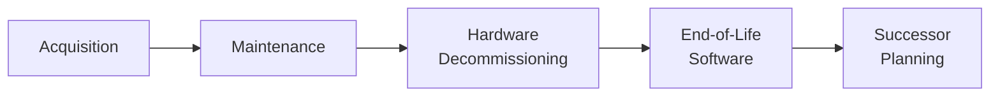

  - **Acquisition** — obtain the resource (buy hardware, hire staff, license software).
  - **Maintenance** — keep it running (servicing, patching, support).
  - **Hardware decommissioning** — safely retire old equipment (wipe data, then dispose of or recycle it).
  - **End-of-life software** — retire software the vendor no longer supports or patches.
  - **Successor planning** — line up the replacement (next-gen hardware, upgraded software, or a trained backup person) *before* the current resource is gone.

**Human resources:**

- **Dedicated** — 100% of their time is on the project.
- **Shared** — only a slice of their time is on the project.
- **Over-allocated** — too much work has been assigned to them.
- **Benched** — available but not currently being used.
- **Internal** — employees.
- **External** — contractors.
- **Core / operational** — on the project from start to finish.
- **Extended / functional** — jumps in when needed (often a specialist).

### Organizational structures

How much authority the PM has depends on the structure:

| Structure | PM authority |
|---|---|
| **Functional** | Limited — staff grouped by specialty |
| **Weak matrix** | Low to none |
| **Balanced matrix** | Medium |
| **Strong matrix** | Moderate to high |
| **Projectized** | High to almost total — staff grouped by project |

In a **matrix**, the PM *shares* authority with functional managers.

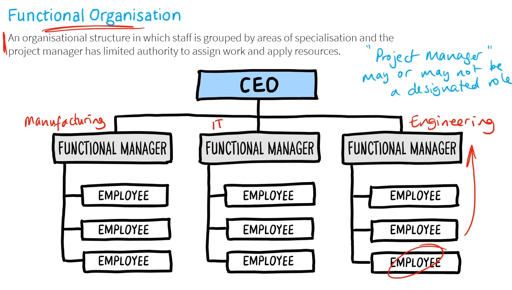

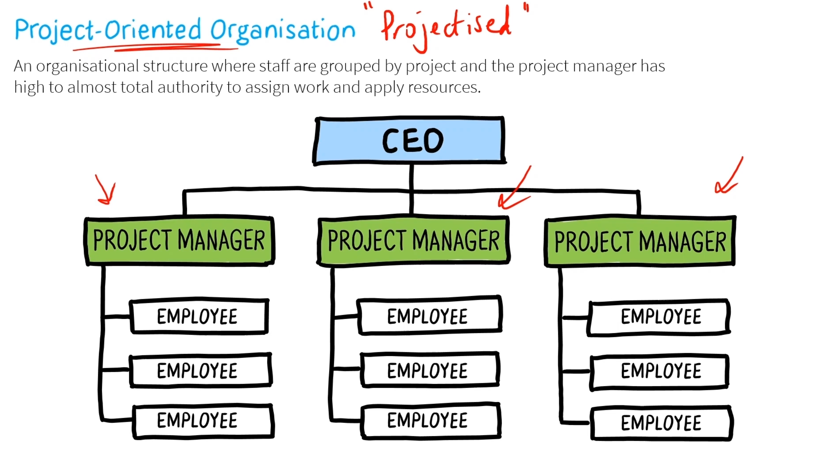

### Key roles

- **Project Manager** — leads the team; controls the budget, decisions, and resources.
- **Functional Manager** — runs a business unit.
- **Project Coordinator** — limited authority (functional / weak-matrix setups).
- **Sponsor** — pays for the project; may be the customer.
- **Stakeholder** — anyone affected by the project, internal or external.
- **PMO (Project Management Office)** — supports project management efforts.
- **Program Manager** — coordinates related projects toward a business goal.
- **Business Analyst** / **Product Manager** — focus on the end product.
- **Project Team** — architects (design), developers/engineers (build), testers/QA — quality assurance (verify), SMEs (specialist knowledge).
- **Scrum Master** — servant leader who clears blockers for the Agile team.

### Acquiring & assigning resources

- **Gap analysis** — measure where you are vs. where you want to be (resource pool, skills).
- For external resources, use **vendor evaluation** (cost-benefit, competitive analysis, technical approach, references).
- **Resource loading** fills available time with tasks; use the **project org chart** and **RACI (Responsible, Accountable, Consulted, Informed) matrix** as tools.

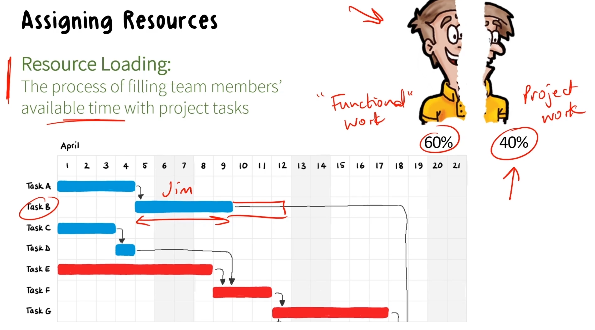

### Team development — the Tuckman Ladder

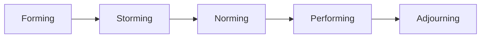

- **Forming** — getting acquainted; still a group, not a team. *Example: in kickoff week, members are polite and unsure of each other, and wait for direction.*
- **Storming** — roles emerge and friction shows; performance can dip. *Example: two developers clash over which tech stack to use, and progress slows.*
- **Norming** — trust and collaboration build. *Example: the team agrees on coding standards and starts helping each other hit deadlines.*
- **Performing** — the team clicks and builds on each other's ideas. *Example: features ship smoothly and the team solves problems without the PM stepping in.*
- **Adjourning** — the team wraps up and disbands. *Example: after go-live, the team documents lessons learned and members roll off to new projects.*

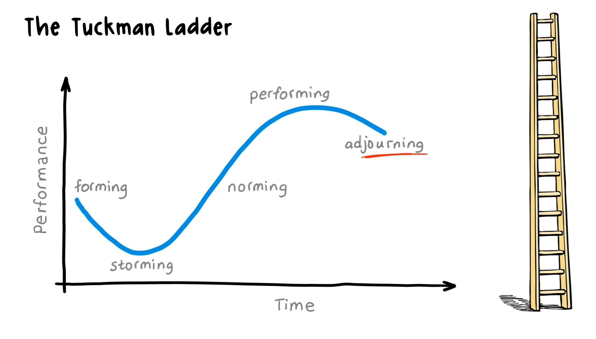

---

## 1.11 — Procurement & vendor selection

### How will we get the resource?

- **Build / make**, **Buy**, **Lease**, or **Subscription / pay-as-you-go**.

**CapEx vs. OpEx:**

- **CapEx (capital expenditure)** — big investments on the balance sheet, depreciated over time.
- **OpEx (operational expenditure)** — ongoing expenses, often tax-deductible.

### Artifacts we may already have

- **Pre-qualified vendors** — an approved-vendor list.
- **Pre-determined clients** — partners who resell our product.
- **Pre-existing contracts** — agreements already in place that the project can use instead of starting from scratch.

### Engaging vendors (the "RFx" docs)

- **RFI** — Request for Information. Early fact-finding to learn what vendors can offer.
- **RFP** — Request for Proposal (detailed, complex; design approach, timelines, costs).
- **RFQ** — Request for Quote. Asks vendors for a price on clearly defined goods/services.
- **RFB** — Request for Bid. Invites vendors to bid on well-specified work, usually competing on price.

### Contract types

- **Fixed-price** — a set price; best when scope is well defined. Three flavors:
  - **FFP (Firm Fixed Price)** — one set price, no adjustments.
  - **FPIF (Fixed Price Incentive Fee)** — fixed price plus a bonus for hitting targets (e.g., early delivery).
  - **FPEPA (Fixed Price with Economic Price Adjustment)** — fixed price that can flex with inflation or currency shifts on long contracts.
- **Cost plus (cost reimbursable)** — buyer pays the cost *plus* a fee; best when scope will change a lot. Three flavors:
  - **CPFF (Cost Plus Fixed Fee)** — costs reimbursed plus a fixed fee. *Example: a vendor builds your server room; you cover all material and labor costs plus a flat $50k fee, no matter the final cost.*
  - **CPIF (Cost Plus Incentive Fee)** — costs reimbursed plus a performance-based bonus. *Example: costs covered, plus a $20k bonus if they finish testing two weeks early.*
  - **CPAF (Cost Plus Award Fee)** — costs reimbursed plus a fee the buyer awards based on satisfaction. *Example: costs covered, plus a discretionary fee granted after a quarterly quality review.*
- **Time and materials** — a hybrid of the two; e.g., labor billed at an hourly rate plus materials.

### Other vendor documents

- **SOW** — Statement of Work (what we're buying).
- **TOR** — Terms of Reference (scope, timeline, resources).
- **NDA** — Non-Disclosure Agreement.
- **C&D Letter** — Cease and Desist (stop now and don't repeat).
- **LOI** — Letter of Intent. **MOU** — Memorandum of Understanding.
- **MSA** — Master Service Agreement (umbrella terms for future contracts).
- **SLA** — Service Level Agreement (expected service level).
- **Maintenance Agreement** — a contract for ongoing upkeep, support, or servicing of a product after delivery (e.g., scheduled servicing, fixes, updates).
- **Warranty** — the vendor's promise that a product will work as specified for a set period, and that they'll repair or replace it if it doesn't.
- **PO** — Purchase Order (buyer's commitment to pay).

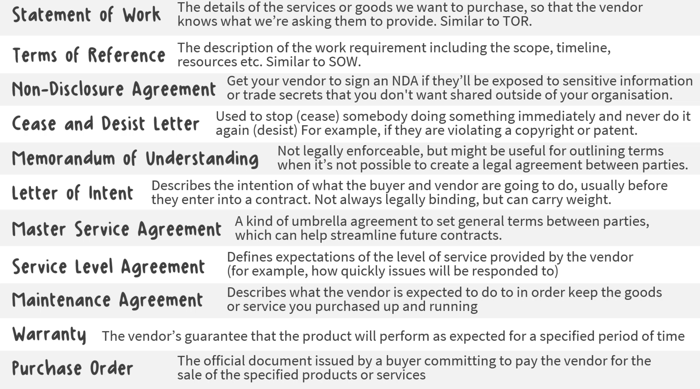
