# Domain 2 — Project Life Cycle Phases

> **Exam weight: 30%.** Walks through a project start to finish: discovery, initiation, planning, execution, and closing.

### The five phases at a glance

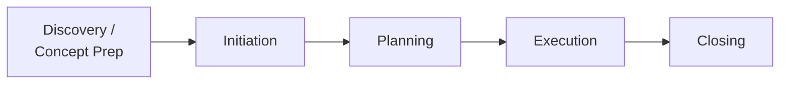

**Jump to an objective:**

- [2.1 — Discovery / concept preparation](#21--discovery--concept-preparation)
- [2.2 — Initiation](#22--initiation)
- [2.3 — Planning](#23--planning)
- [2.4 — Execution](#24--execution)
- [2.5 — Closing](#25--closing)

---

## 2.1 — Discovery / concept preparation

**The core question:** *Is this project even worth doing?*

This phase is about building the **business case** — the value proposition for the project. Typical work: analyze return on investment (ROI), prepare the business case, identify existing contracts to reuse, and rough budgeting.

### Picking the right project

Two broad approaches: **mathematical modeling** (use formulas/algorithms to score projects against constraints) and **benefits comparisons** (weigh the financial return of each option). The benefits-comparison methods you should know:

- **Net Present Value (NPV)** — money today is worth more than money later. **Bigger NPV = better.**
- **Return on Investment (ROI)** — a percentage; how much you'll make.
- **Internal Rate of Return (IRR)** — a percentage; **bigger = better.**
- **Benefit-to-Cost Ratio (BCR)** — dollars back per dollar invested.

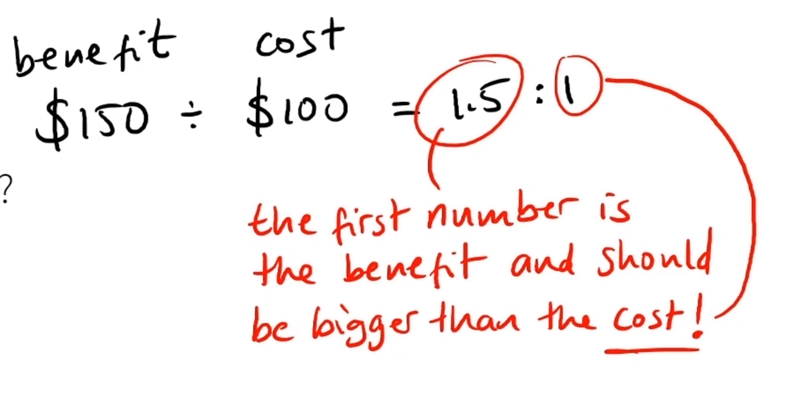

- **Payback Period (PBP)** — how long to recoup the cost. **Shorter = better.**
- **Scoring Model** — pick criteria, weight them, score each project.
- **Opportunity Cost** — what you give up by choosing this over alternatives.

### Financial framing

- **CapEx** — capital expense (big, depreciated, on the balance sheet).
- **OpEx** — operational expense (ongoing, often tax-deductible).

> Procurement preferences and vendor artifacts are covered in [Domain 1 → 1.11](Domain1-Project-Management-Concepts.md#111--procurement--vendor-selection).

---

## 2.2 — Initiation

**What it is:** the formal authorization for the project to begin.

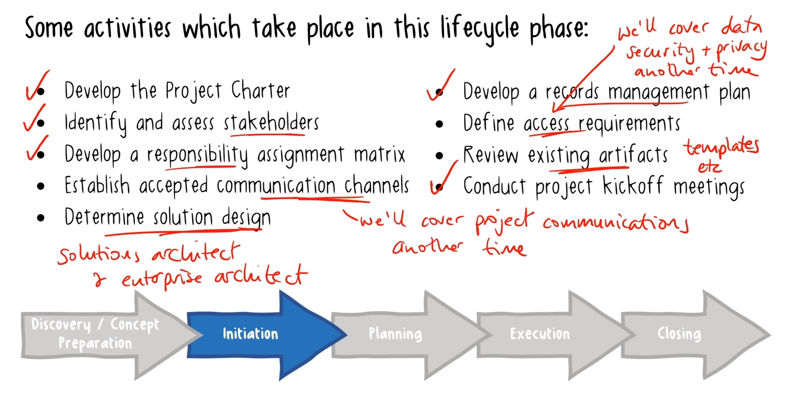

> See filled-in examples in [`samples/`](samples/): [Business Case](samples/01-business-case.md), [Project Charter](samples/02-project-charter.md), [Scope Statement](samples/03-scope-statement.md), and [RACI Matrix](samples/09-raci-matrix.xlsx).

### The project charter

The **charter** is issued by the **sponsor** and formally authorizes the project. The sponsor provides resources and support and is accountable for success.

> It is **not** a contract.

A charter typically holds:

- Purpose, high-level requirements, and quantifiable objectives.
- Overall project risk.
- Summary schedule and budget (high-level estimate).
- Key stakeholders.
- Success criteria and approval.
- Exit criteria (when we'd cancel).
- The PM's name and authority level.
- Assumptions and constraints.

### Identifying & assessing stakeholders

A **stakeholder** is anyone who affects, is affected by, or thinks they're affected by the project.

- **Internal** — sponsor, PMO (project management office), program manager, team members, other managers.
- **External** — customers, end users, suppliers, shareholders, competitors.

**Assessment techniques:**

- **Classification grids** — power/influence, power/interest, impact/influence.
- **Stakeholder cube** — 3D view of power, influence, impact.
- **Salience model** — power, legitimacy, urgency.
- **Directions of influence** — who they can sway.

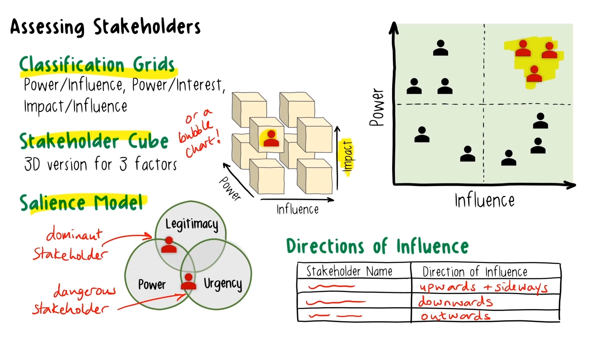

### RAM & RACI

A **Responsibility Assignment Matrix (RAM)** clarifies who does what and builds buy-in early. **RACI** is the common type:

| Letter | Role | Meaning |
|---|---|---|
| **R** | Responsible | Does the work |
| **A** | Accountable | Owns the outcome (only one) |
| **C** | Consulted | Gives input beforehand |
| **I** | Informed | Kept in the loop after |

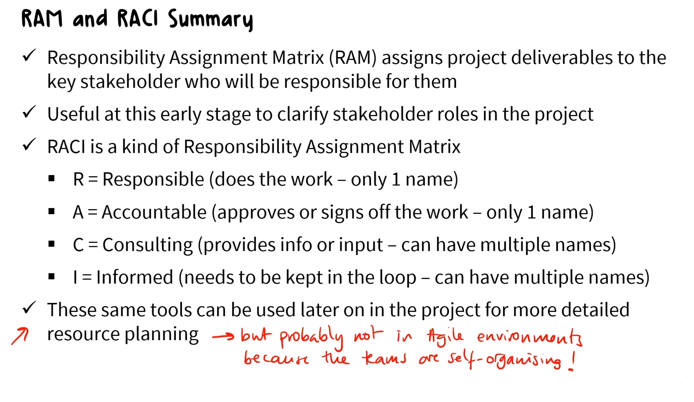

### Records management plan

First, the distinction:

- **Document** — any written info; editable; kept short or long term.
- **Record** — evidence; final and unchangeable; kept for a set period.

The plan covers: what counts as a record, where things are stored, classification, retention, and disposal.

### Agile product vision & roadmap

- **Product vision** — a short statement of the product's business purpose.
- **Visioning workshop** — surfaces what matters, sets expectations, identifies risks, turns features into benefits.
- **Product roadmap** — general timeframes for major themes; a strategic planning tool.

### Project kick-off

The **kickoff meeting** is the first official meeting between team and sponsors. Use it to: make introductions, share purpose and goals, set expectations, and clarify roles.

---

## 2.3 — Planning

This is where the detailed plan comes together.

### The project management plan & baselines

The **project management plan** defines how the project is executed, monitored/controlled, and closed. It contains **four baselines** — fixed reference points for measuring progress:

1. Scope
2. Schedule
3. Cost
4. Performance measurement

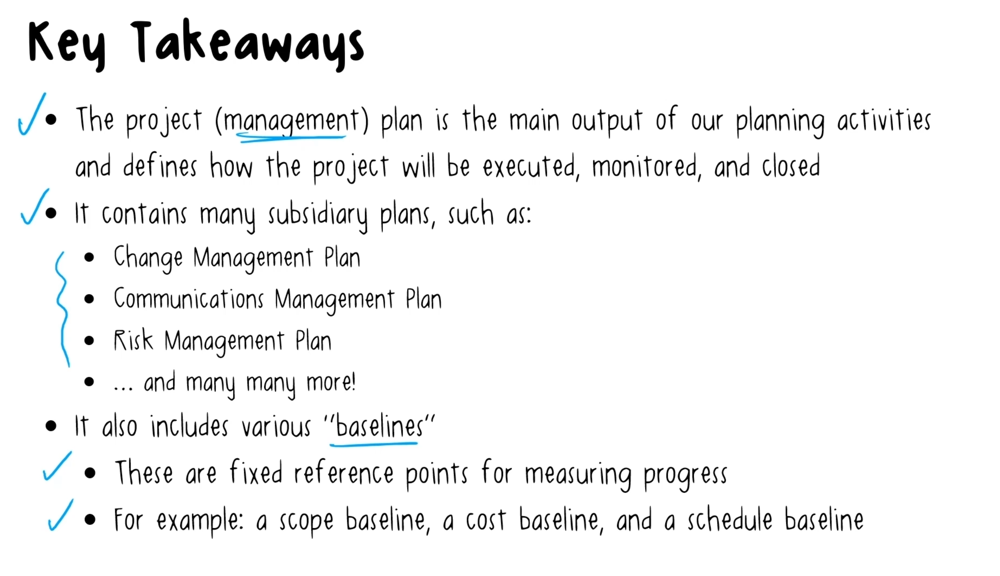

### Scope: product vs. project

- **Product scope** — the features and functions. *How the product works.*
- **Project scope** — the work to deliver it. *Tools and processes.*
- **Scope statement** — officially declares what's being done, including exclusions.

A **detailed scope statement** contains scope descriptions (progressively elaborated), measurable deliverables, acceptance criteria, and exclusions. Once approved, it becomes part of the **scope baseline**.

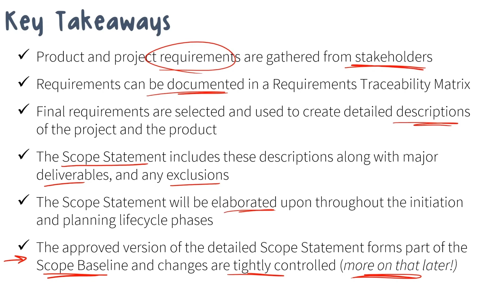

**In Agile,** scope changes are managed by refining the **product backlog**.

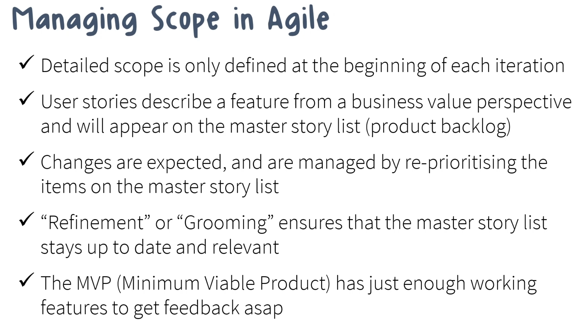

### Defining units of work (WBS)

- In Agile, the **product backlog** defines units of work.
- In Waterfall, decompose deliverables into **work packages** (work packages are *deliverables*, not activities).
- The **Work Breakdown Structure (WBS)** shows the hierarchy; the **WBS Dictionary** adds detail.
- Scope Statement + WBS + WBS Dictionary together = the **scope baseline**.

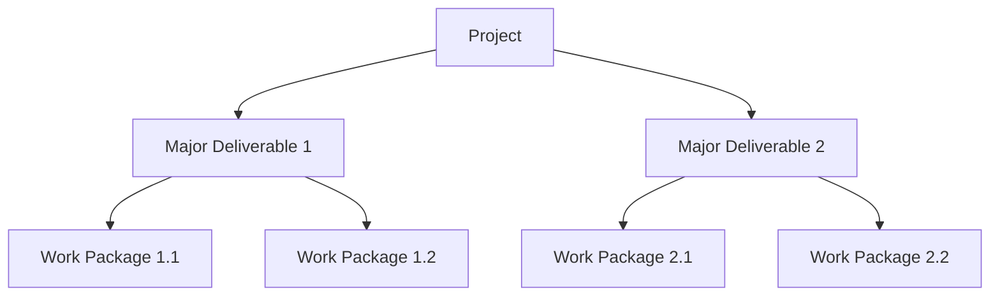

### The triple constraint

Three forces in tension — change one and the others shift:

1. **Cost**
2. **Scope**
3. **Time**

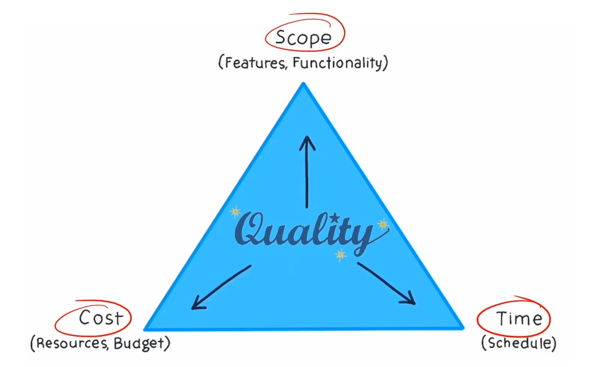

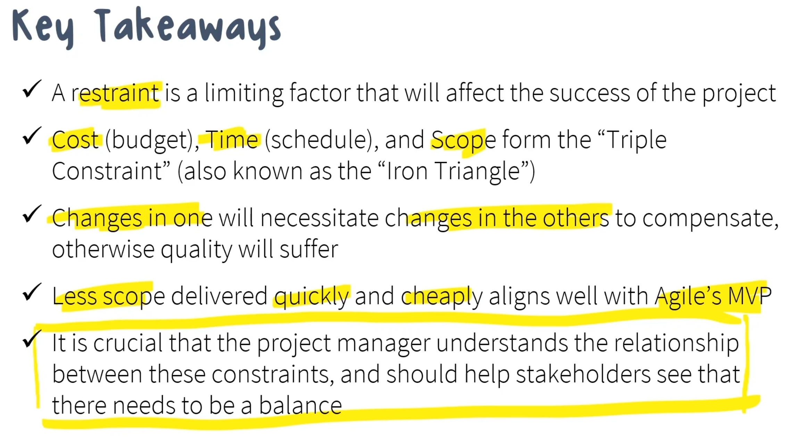

### Transition / release plan

The **transition plan** makes sure new owners have everything they need to take over:

- Knowledge transfer, documentation, training plans.
- Asset transfer, maintenance requirements, warranty period.
- Post-implementation costs.

**Release planning** (Agile) decides when features ship to users — usually at the end of iterations.

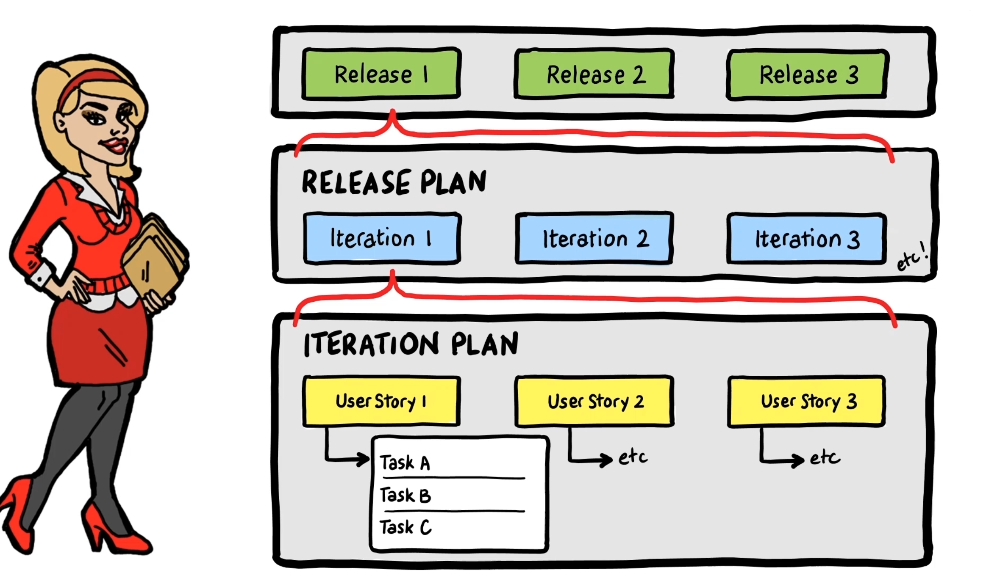

> Schedule development, budgeting, and detailed risk/quality planning are concepts covered in [Domain 1](Domain1-Project-Management-Concepts.md) (objectives 1.4, 1.6, 1.7).

---

## 2.4 — Execution

**The core idea:** do the work in the plan, and keep things on track.

### Organizational change management

Changes that can hit a project mid-flight:

- **Merger or acquisition** — may reset goals and stakeholders.
- **Demerger or split** — often negative.
- **Internal reorganization** — affects the team.
- **Business process change** — new processes, often driven by new regulations.

**How to manage change:** identify it → analyze impact → communicate → train → monitor adoption → document.

### Managing conflict (Thomas-Kilmann)

Five ways to handle conflict, each with a sweet spot:

- **Avoiding** — emotionally charged moments, trivial issues, or wrong time/place.
- **Forcing** — last resort; quick call on a high-priority issue.
- **Compromising** — low-priority issues, or when the relationship matters.
- **Accommodating (smoothing)** — extenuating circumstances, or when it's low-cost to you.
- **Collaborating** — complex, important, or recurring issues needing a permanent fix.

> Performance tracking during execution (cost/schedule variance, KPIs, phase gate reviews) is covered in [Domain 1 → 1.7](Domain1-Project-Management-Concepts.md#17--quality--performance-management).

---

## 2.5 — Closing

### How projects end

A project ends when objectives are met and the sponsor validates the deliverables. It can also end early — cancellation, budget cuts, resources pulled to higher priorities, or simply not meeting objectives.

**Four termination types:**

1. **Starvation** — ends because it's starved of resources.
2. **Extinction** — completed (successfully *or* not — e.g., killed by failing regulations).
3. **Addition** — becomes a standalone, ongoing operation.
4. **Integration** — folded into existing operations across the org.

### Closing activities

- **Release resources** — people and physical assets; close contracts; celebrate and reward.
- **Budget reconciliation** — final financial review; resolve discrepancies.
- **Archive documentation and review access** — keep what regulations/PMO require; remove access that's no longer needed.
- **Project closeout report** and **closure meeting**.

> Lessons learned, retrospectives, and verification/validation are covered in [Domain 1 → 1.7](Domain1-Project-Management-Concepts.md#17--quality--performance-management).
