# Domain 3 — Tools and Documentation

> **Exam weight: 19%.** The charts, tools, and documents you use to run and report on a project.

**Jump to an objective:**

- [3.1 — Tools throughout the life cycle](#31--tools-throughout-the-life-cycle)
- [3.2 — Productivity tools](#32--productivity-tools)
- [3.3 — Quality & performance charts](#33--quality--performance-charts)

---

## 3.1 — Tools throughout the life cycle

### Tracking charts

Each chart answers a different "where are we?" question:

- **Task board (Kanban board)** — shows work items moving through stages.

  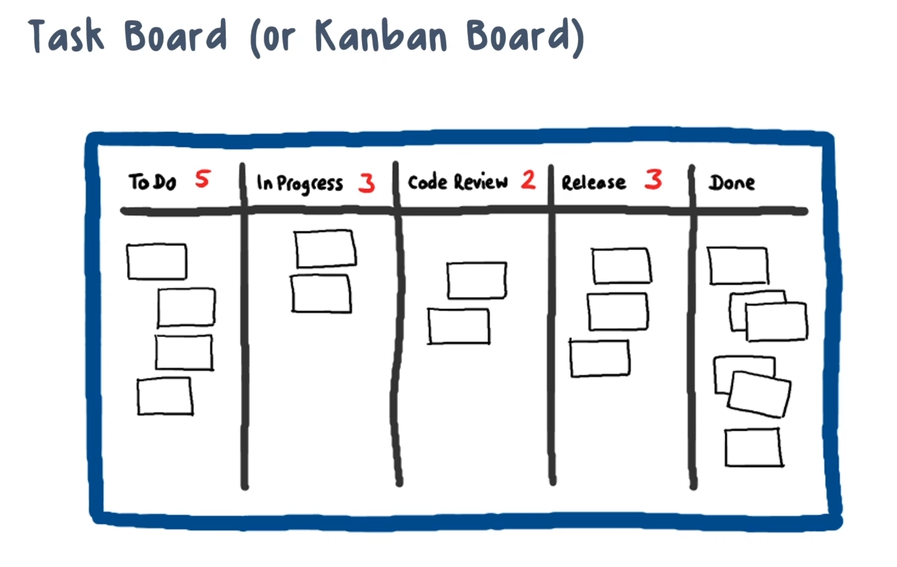

- **Gantt chart** — bars show each task's timeline.

  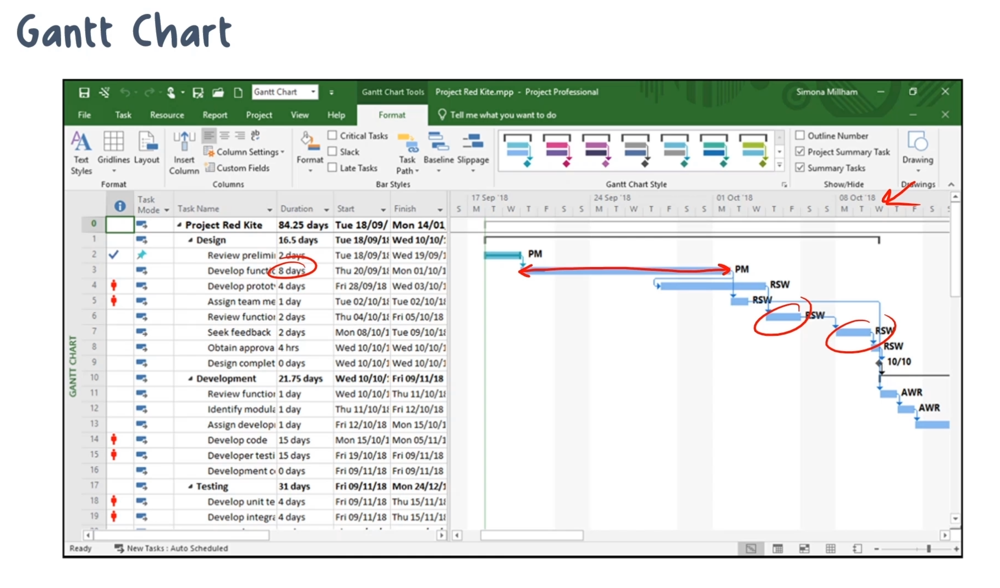

- **Project network diagram (PERT — Program Evaluation and Review Technique)** — shows work and dependencies as a network.

  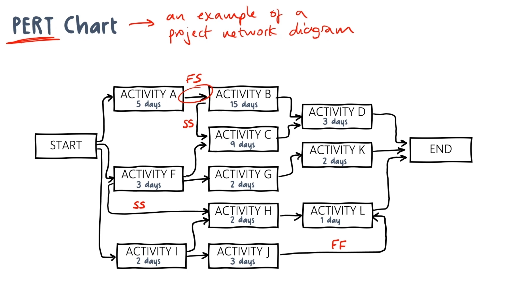

- **Milestone chart** — key milestones and their target dates.

  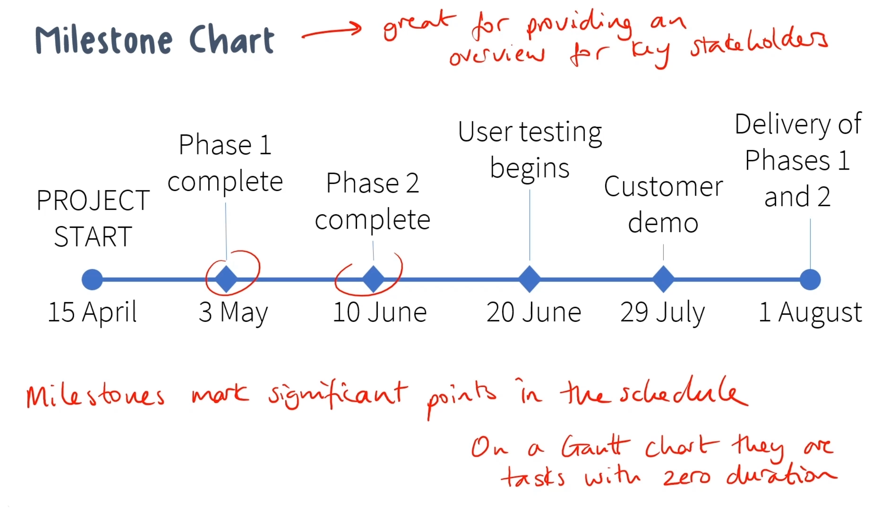

- **Project organization chart** — the team's reporting structure.

  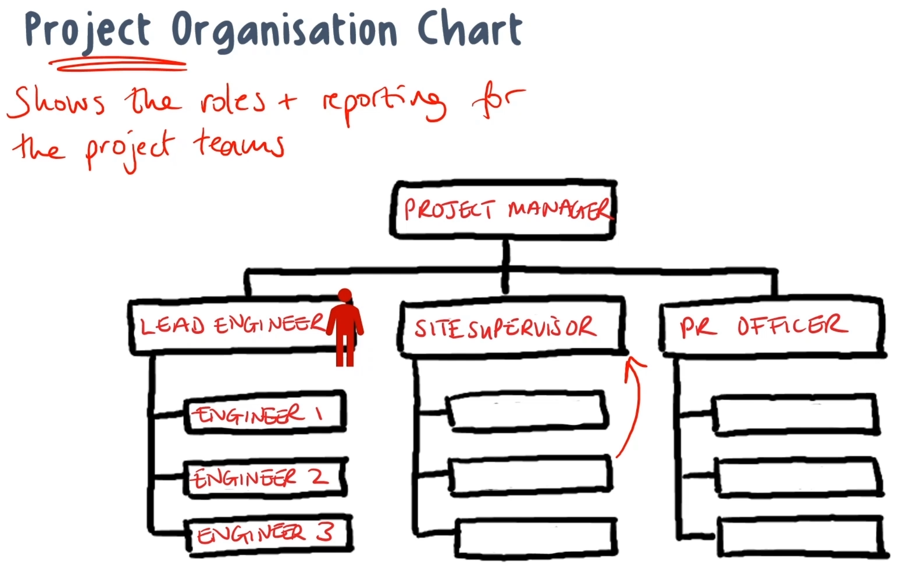

### Documents, logs & registers

The records that keep a project honest:

| Document | What it's for |
|---|---|
| **Business Case** | Should the project proceed? Needs, options, recommendation, feasibility. |
| **Project Charter** | Authorizes the project; sets objectives, boundaries, success criteria. |
| **Project Management Plan** | How the project is run; holds subsidiary plans + baselines (scope, schedule, cost). |
| **Requirements Traceability Matrix (RTM)** | Tracks who requested each requirement, its justification, and its WBS link. |
| **Risk Register** | Logs all outputs from risk management activities. |
| **Risk Report** | Summarizes individual risks and overall project risk. |
| **Change Log** | All submitted changes and their status. |
| **Issue Log** | Records issues and tracks their status. |
| **Defect Log** | Records results of inspections and tests. |
| **Status Report** | Summarizes project progress. |

#### Sample entries

> Full filled-in versions of these documents are in [`samples/`](samples/) — including Excel [Risk Register](samples/06-risk-register.xlsx), [Issue Log](samples/07-issue-log.xlsx), [Change Log](samples/08-change-log.xlsx), and [RACI Matrix](samples/09-raci-matrix.xlsx).

- **Business Case:** *"Migrating to cloud hosting cuts server costs ~30% ($60k/year). Recommend proceeding with AWS over an on-prem refresh."*
- **Project Charter:** *"Deliver a self-service customer portal by Q4. Sponsor: VP of Sales. PM authorized to spend up to $150k."*
- **Project Management Plan:** *"Work proceeds in 2-week sprints. Scope, schedule, and cost baselines are set. All changes route through the CCB."*
- **Requirements Traceability Matrix (RTM):** *"REQ-014 'password reset' — requested by the Security team, justifies a SOC 2 control, maps to WBS item 3.2."*
- **Risk Register:** *"R-01: cloud API delay — Medium probability / High impact — mitigate by starting integration early — owner: J. Lee."*
- **Risk Report:** *"Overall project risk: Medium. Top risk: vendor delay. 3 high risks open, 2 closed this month."*
- **Change Log:** *"CR-007: add single sign-on login — approved by the CCB on May 4 — status: in development."*
- **Issue Log:** *"I-02: login page rejects valid users — Critical — owner: A. Kim — Resolved May 6."*
- **Defect Log:** *"D-11: checkout miscalculates sales tax — found in regression testing — severity: High — fixed."*
- **Status Report:** *"Week 12: 80% of the sprint complete, on budget, one high issue open, go-live on track for June 1."*

---

## 3.2 — Productivity tools

This objective covers the everyday tools teams use to get work done:

- **Communication tools** — email, messaging/chat/SMS (short message service), telephone, video, meetings, enterprise social media.
- **Collaboration tools** — real-time co-editing, file sharing, e-signature/workflow, whiteboards, wikis, version control, time tracking, task boards, the RTM.
- **Meeting tools** — polling, calendaring, conferencing platforms, print media.
- **Documentation / office tools** — word processing, spreadsheets, presentations, diagramming.
- **PM scheduling tools** — cloud-based vs. on-premises vs. local install.
- **Ticketing / case management** systems.

> For how to *choose* a communication method, see [Domain 1 → 1.8](Domain1-Project-Management-Concepts.md#18--communication-management).

---

## 3.3 — Quality & performance charts

These charts turn raw project data into decisions.

### Quality charts

- **Scatter diagram** — the relationship between two variables.

  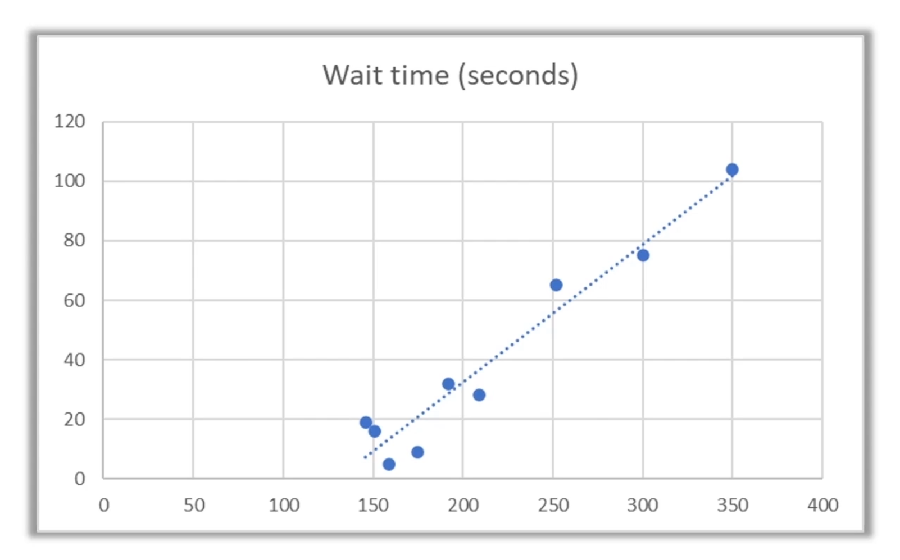

- **Histogram / Pareto chart** — frequency distribution (e.g., defects by type).

  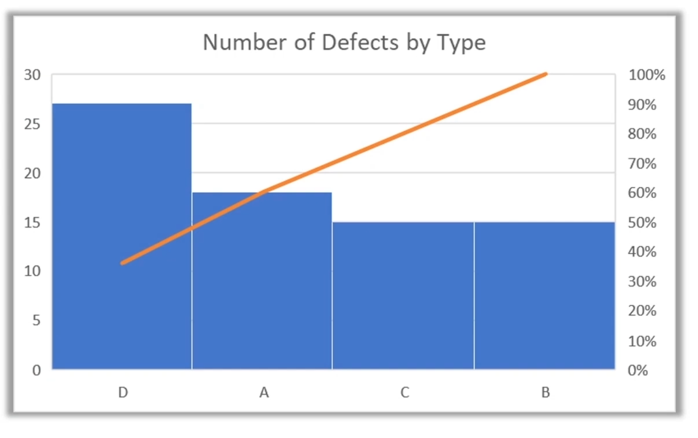

- **Control chart** — whether a process is stable and within limits.

  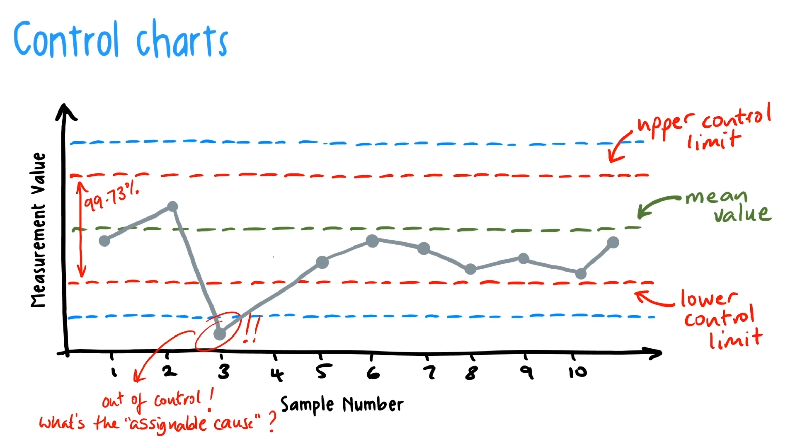

### Performance & progress charts

- **Run chart** — a line chart of data over time; shows performance trends.

  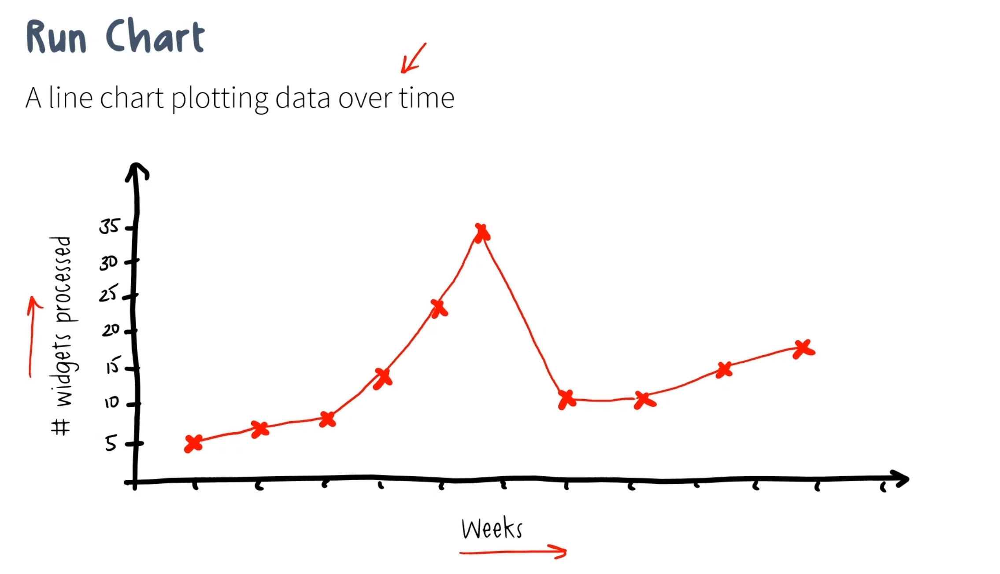

- **Burndown chart** — work (or budget) remaining over time.

  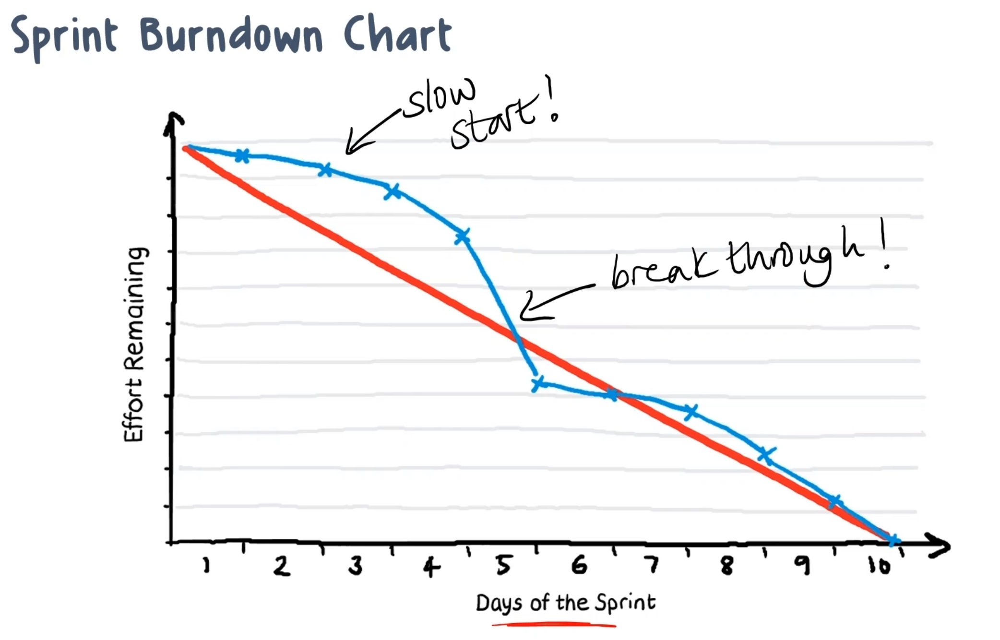

- **Burnup chart** — work completed over time against total scope.

  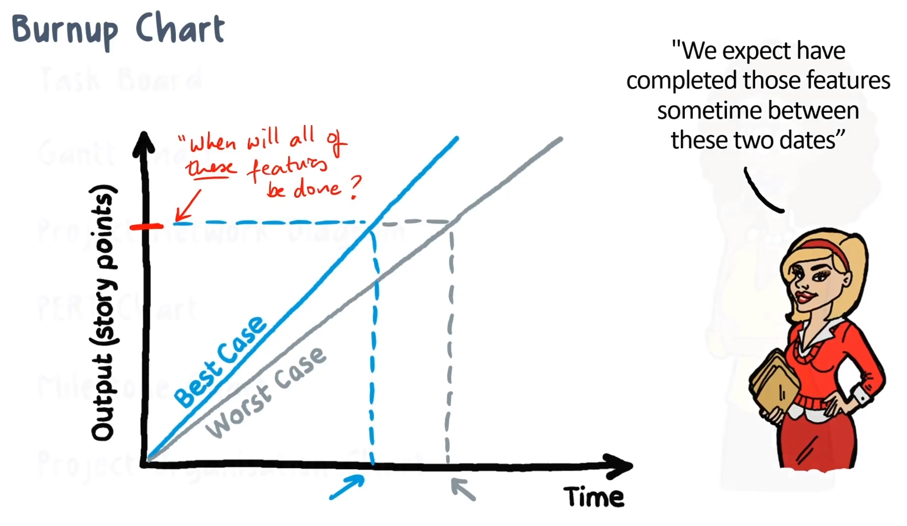

- **Velocity chart** — an Agile (Scrum) measure of how much work the team completes per sprint.

  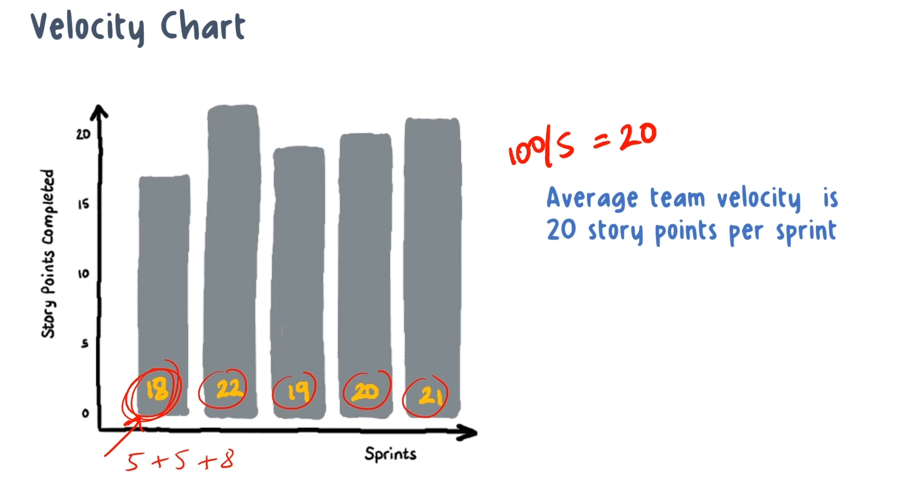

- **Decision tree** — a map of outcomes across a series of related choices.

  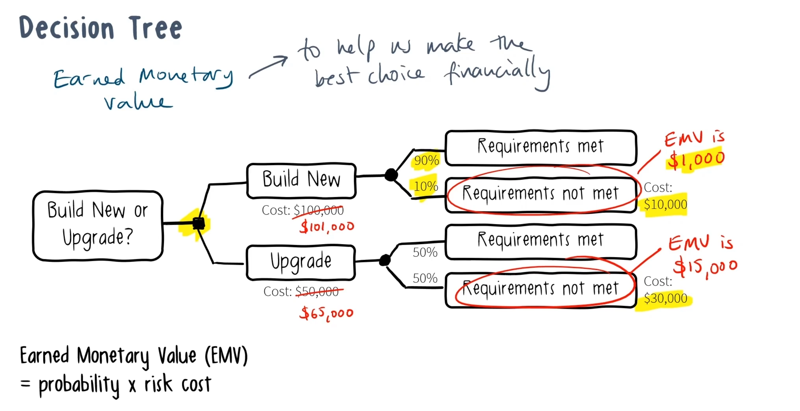
